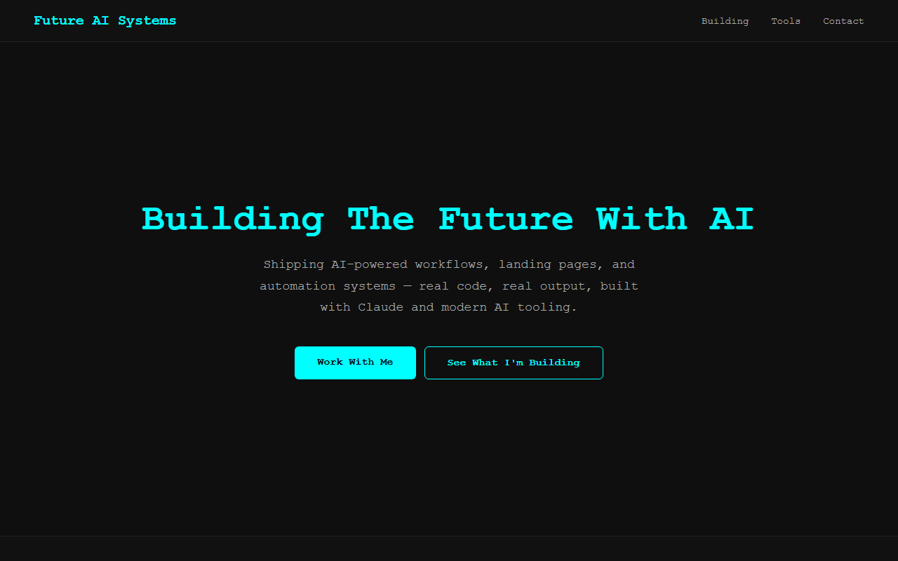

# Future AI Systems

**Live site → https://huh-cmd.github.io/future-ai-systems/**

---

## About This Project

Custom landing page built from scratch — no templates, no page builders. Designed, coded, and deployed in a single session as a live portfolio piece.

Built to demonstrate:
- Clean frontend development (HTML / CSS / JS)
- Mobile-responsive layout (tested at 375px)
- Real deployment workflow via GitHub Pages
- AI-assisted development using Claude Code

---

## Stack

| Layer | Tools |
|-------|-------|
| Frontend | HTML5, CSS3, Vanilla JavaScript |
| Deployment | GitHub Pages |
| Built with | Claude Code |

---

## Services

This page is a working example of what I build for clients.

| Service | Starting at |
|---------|------------|
| Landing page (custom) | $150 |
| AI workflow automation | $500 |
| Claude Code consulting | $125 / hr |

**Get in touch:** jeffe5196@gmail.com

---

*Part of the [Future AI Systems](https://huh-cmd.github.io/future-ai-systems/) portfolio.*
